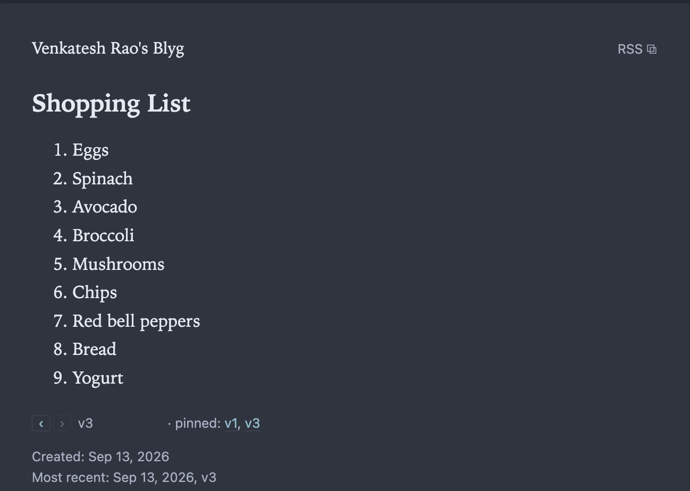
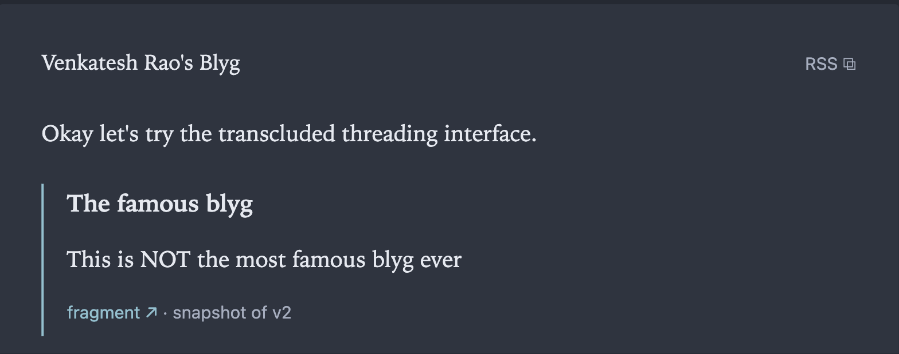
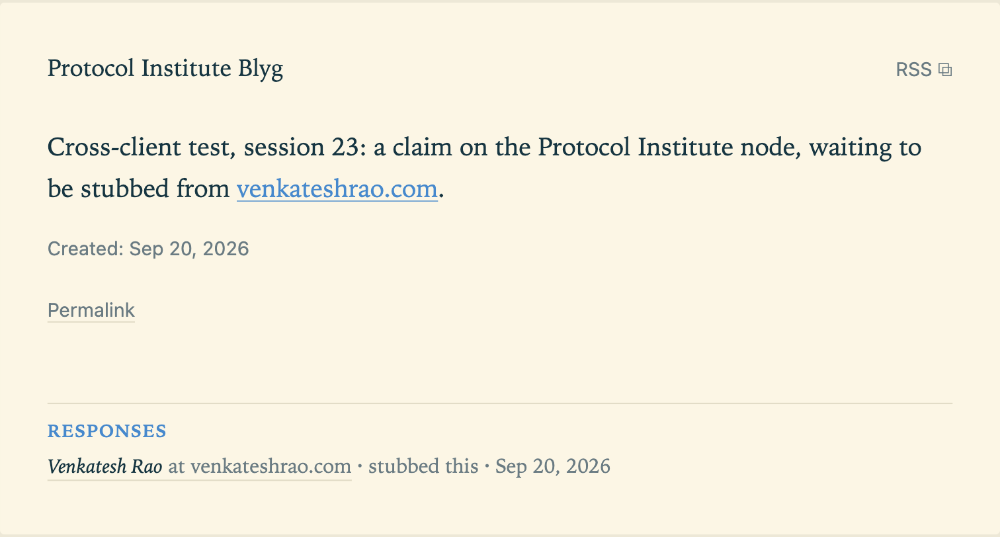
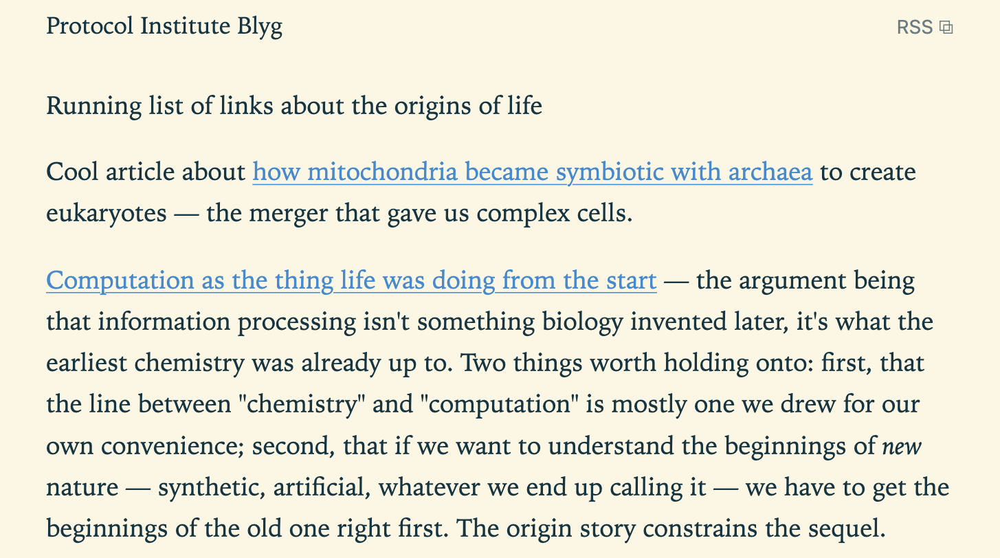
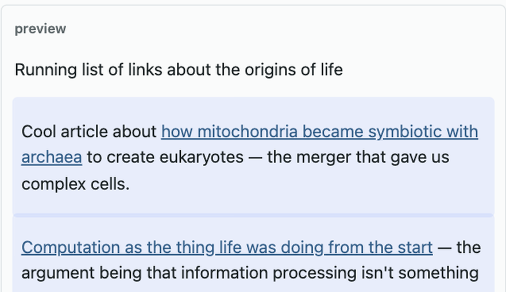

<!--
  One file, one talk. Edit this; everything else is derived.

  Format:
    # Heading        starts a SECTION (applies to slides that follow)
    ## Heading       starts a SLIDE
         the slide's image — ordinary markdown, alt text included
    - a list         what's PROJECTED. Nest with two spaces for sub-bullets.
    **Cues**         speaker prompts below the fold. Not projected.
    **Notes**        "why this slide exists", collapsed on the page.

  Slides are numbered by position, so inserting or reordering one renumbers the
  rest automatically — no ids to keep in sync. The cost is that #slide-NN
  permalinks move when you insert above them, which is the right trade while the
  deck is still in draft.

  A slide with no bullets is treated as a placeholder and marked as such.
-->

# Opening

## What is Blygger

- A decentralized, p2p, AI-native social publishing protocol
- A **minimal** update to the blogging and old-Twitter experiences — not a new one
- Degrades gracefully: legacy RSS readers see an ordinary feed and lose nothing
- Some inspiration from Robin Sloan's Spring '83
- Fixes the **synchronic/diachronic temporality tension** in traditional media
  — loosely, "Twitter time" vs. "GitHub time"
- Supports fine-grained generative AI use at the **block** level

**Cues**

- Read the list fast; the two that matter are the last two, and they're the rest
  of the talk.
- "Minimal" is doing work: this is not a new medium, it's a small change to two
  existing ones.
- Spring '83 — name-check, don't explain unless asked.

**Notes**

Deliberately a dense opening list rather than a slow build: this audience wants the
shape of the thing in thirty seconds, and the two load-bearing claims (temporality,
block-level generation) each get their own section later.

## Etymology

- **Blyg** — Swedish for "shy", and nearly homophonic with "blog"
- **Blygger** — a hat-tip to Blogger
- **ygg** — a gesture at Yggdrasil, the Norse cosmic tree of life
- **Why these two** — near-miss spellings of blog/blogger, and both domains were free
- **blygger.org** is the protocol home; **blygger.com** is a future directory

**Cues**

- Quick slide. Don't over-explain the joke.
- If it lands, the shy/blog homophony is the one worth pausing on.
- The domains being available is not a footnote — it is why these spellings and
  not the dozen other near-misses. Naming a protocol is partly a squatting check.
- Don't promise a date for the directory. blygger.com is a stub today (slide 28).

**Notes**

Three readings stacked in one word, which is the right amount of etymology for a
protocol talk: enough that the name is memorable, not so much that it becomes the
subject.

## Demo

**Cues**

- Break away here. Nothing is projected — the slide is a marker, not a slide.
- Live nodes: `venkateshrao.com/blyg/` and `blyg.protocol-institute.org`.
- Forking across nodes: **resync** on the subscriptions page first, then `fork ↗`
  in reading. Don't wait on the 30-minute importer cron.
- Pin and fork both raise a browser confirm dialog, and a pin is irrevocable —
  worth saying that out loud rather than clicking past it.
- Public pages cache for 60s. Hard-reload after publishing, or show a fresh tab.
- Come back in on **Two kinds of time** — the conceptual spine follows the demo.

**Notes**

A deliberately bare slide: projecting a bullet list while demoing live would
split the room's attention between the screen and the thing being shown. The
title holds the place in the deck and the permalink sequence; everything the
speaker needs is in the cues, which are not projected.

## Two kinds of time

- **Diachronic** — time as a *sequence of states*; the changing is the point
  - a git log, a blog series, a book's editions, a changelog
- **Synchronic** — time as a *present moment*; the snapshot is the point
  - a Twitter feed, a group chat, a livestream

**Cues**

- Define both properly — this is the conceptual spine and the room needs the words.
- Diachronic: the thing changes, and the *record* of it changing is the point. A git
  commit carries a message about what changed.
- Synchronic: hot takes, all now, never revised. The moment is the point.
- GitHub time vs. Twitter time as the handles; the Greek is the precision.
- Neither is better. They're different things media are for.

**Notes**

The whole design argument rests on these two words, so they get a slide of their own
rather than a passing definition. Sub-bullets are examples, not argument — say them
fast.

## Handling both at once is hard

- **Threads are clumsy** — a synchronic medium doing an impression of a diachronic one
- **Editable tweets break provenance** — if it can change silently, what did you
  actually say?
- **Nobody reads changelogs** — a diachronic record with no synchronic surface
- **Citation messiness** — diachronic documents make synchronic citation messy
- Each fix for one property damages the other

**Cues**

- These are four failed attempts at the same problem, not four separate gripes.
- The provenance point is the one this audience will already have opinions about.
- Citation messiness is the scholarly end of the same complaint: if the document
  moves, a citation to it either rots or silently means something else. Cite a
  version or cite a moving target — pick one. This is what pins answer later.
- Land: nobody has made one medium do both well.

**Notes**

Four concrete, familiar failures rather than an abstract statement of the tension —
everyone in the room has been annoyed by all of them, which does the persuading for you.

## Books solve this by being very, very slow

- An **edition** is a diachronic event a synchronic reader can actually see
- It works *because* editions are rare — years apart, a handful per book
- You cannot run a conversation at that tempo
- So: keep the edition, drop the latency

**Cues**

- The one existing solution that works, and why it doesn't generalise.
- Last bullet is the hinge into the rest of the talk — pins are editions at
  conversation speed.

**Notes**

Closes the opening by naming the one medium that genuinely solves the tension, then
naming its cost. Sets up pins (slide 21) as the answer without spending the word yet.

# How it feels to use

## A blyg is fragments and threads

- Two units, not one: a **fragment** (a note) and a **thread** (fragments composed)
- Every item wears its own revision history in public — `v3 · pinned: v1, v3`
- A real page, live at venkateshrao.com/blyg/

**Cues**

- Live page, mine, right now.
- Most media give you one unit and you pretend everything is that shape.
- Point at the version line. Every item wears its revision history in public.
  Needs no explanation — it's on the page.
- That line is the diachronic surface, sitting inside a synchronic feed.

**Notes**

Opens on the artifact rather than the architecture, and the version line is the thing
to point at: it is the previous section's abstract tension made concrete in one line of
page furniture.

## Transclusion: quote by reference

- Write `![[id]]` on its own line — you get the fragment, not a link to it
- Snapshotted at publish: the reader gets the bytes you saw, forever
- Provenance under every quote: which item, which version
- Editing the source later never rewrites the quote

**Cues**

- The blue-ruled block is not copy-paste. I wrote `![[id]]` on its own line.
- **Snapshotted at publish.** Reader gets the bytes I saw. Editing the source later
  never rewrites this quote.
- Embeds break or drift. This can't do either.
- If there's a line worth landing: quoting is the load-bearing act in written culture
  and most media made it worse.
- **Both of the odd words on the cover are Ted Nelson's** — "transclusion" and
  "intertwingled", *Computer Lib / Dream Machines*, 1974. Name him if the room looks
  like it knows. This is the one idea in the talk that is genuinely fifty years old.

**Notes**

"Never rewrites the quote" is the line that lands with this audience — it's the
difference between transclusion-as-embed (which breaks) and transclusion-as-snapshot
(which doesn't). Real example: venkateshrao.com/blyg/t/1vgtgz0g25ztpdsn9hq23x5pxk/

## Quoting across origins

- Same `![[id]]`, now naming an item on **someone else's** blyg
- It names an *identity*, not an address — resolved against what you've read
- **The snapshot is local**: publishing never touches the network
- A **stub** declares what it answers; a Webmention tells them, and they check

**Cues**

- This is the same mechanism as two slides ago, across a network boundary. Live,
  between my two nodes, right now.
- Three layers, top to bottom: the citation, their paragraph quoted inside it, my own
  text below. Point at each.
- **The colour is not a slide mistake** — it's a different person's blyg, and themes
  are the author's. The protocol has no opinion about them; the CSS contract only says
  which classes a quote must keep.
- **The snapshot is local.** I quote what I read. Their server being down can't stop me
  publishing, and their later edit can't rewrite my quote.
- The header block is the citation — what it answers, at which version, with the URL
  and the date I read it. Frozen at publish, so it still reads when the link dies.
- **Structural verification, if they're engineers:** the receiver fetches my item
  document and checks it actually names them, in a field with a defined meaning.
  Link-presence is the trackback check that spam beat.

**Notes**

The v0.3 headline and the one thing the deck could not show when it was drafted. Real
example, both halves live: `blyg.protocol-institute.org/t/5tt6adc88s2hacnh68h94t1vsf/`
answers `venkateshrao.com/blyg/t/608ay1bz03z3wg58deg787kgvv/`, which answers a fragment
back on the first node. The image is the middle of that stack, which is why the quote
inside it has its own provenance line.

## Quoting what you've already read

- **Ids are global** — 128 random bits, so an id needs no address to be unique
- You can only quote what you have **already imported** from a subscription
- Resolution: your own items first, then your imported copies. Never a fetch
- Same id from two origins → **publish fails**, rather than guessing
- On the wire, one difference: `transclusions[]` gains an `origin`
- **Not a fork** — a fork starts *from* their bytes; this quotes them

**Cues**

- The precondition is the whole answer: **no subscription, no quote.** You cannot
  transclude a blyg you have not read. There is no fetch-by-URL, ever.
- **Asked directly, this is how it differs from forking:** a fork reaches over the
  network for their *pinned file* and starts a new draft from those bytes —
  `forked_from`. This bakes a copy you already hold and quotes it —
  `transclusions[]`. Different act, different field, different promise.
- The origin recorded is the **subscription's own fetch origin**, post-redirect —
  never the manifest's self-asserted `site`. That is what stops a mirror or an
  impostor claiming to be someone else's blyg.
- Plain RSS can't be transcluded: no item documents, no versions, nothing to
  snapshot. The publish error says exactly that rather than failing vaguely.
- Why never-fetch matters, twice over: their host being down cannot block my
  publish, and their later edit cannot rewrite my quote.
- The Webmention tells them afterwards. It is not part of resolution — quoting
  works whether or not they ever hear about it.

**Notes**

Added because the previous slide asserts the same `![[id]]` works across origins and
a protocol audience immediately asks *how* — and the honest answer is a precondition,
not a lookup trick. Also the natural place to kill the assumption that this must be
the fork mechanism, since both point at someone else's item and only one of them
touches the network.

## A list, never a count

- Verified responses can show on the item they answer — off by default, per item
- A **list**: who, which origin, what relation, when. **No number, anywhere.**
- A row costs a real item on a real origin that passed verification
- Nothing a stranger publishes changes your bytes — chrome, not content

**Cues**

- **Plant this; it pays off in "You don't get a username".** This is the one place a
  count could have crept back into the design, and it didn't.
- **Why a list and not a count:** a count is the one thing on your page a stranger can
  move. A row costs them a real published item on a real domain.
- The origin is the load-bearing half of a row — it is the only part the protocol
  vouches for. The name beside it is theirs to assert.
- Last bullet for engineers: a responses list *inside* the versioned document would mean
  someone else's publish changes my bytes, which every subscriber reads as a stealth
  edit. Rendered at request time, in no item document, no feed, no hash.

**Notes**

Sits here rather than in the protocol section because it is the visible half of the
stub mechanism — the other end of the slide before it. The no-count argument is the
medium's whole stance on metrics in one design detail, and it pairs with slide 20.

## Glossary: structure

- **blyg** — one author's published surface: files, feed, manifest
- **item** — the umbrella; a fragment or a thread, each with one id
- **fragment** — the small unit; one note
- **thread** — fragments composed into one item; the only kind that transcludes
- **id** — 128 random bits; names an *identity*, never an address
- **version** — a bare counter, +1 per publish. No semver, ever
- **pin** — an irrevocable promise to serve one version's bytes forever
- **withdrawal** — the content taken back; the id, history and pins remain

**Cues**

- Reference slides, not an argument. Don't read them out — let the room scan.
- **Pin is the one to dwell on** if you dwell on any: it is the only thing here
  that costs the author something, and the only thing a fork can descend from.
- Two things people expect and won't find: no author namespace, and no semver.
  Both are deliberate, and both get their own slide later.

**Notes**

Split from one glossary slide because the terms the deck actually leans on —
`item`, `id`, `pin`, `version` — were never defined anywhere, and nine entries
was already a line over target. Structure here, acts and network on the next.

## Glossary: acts and network

- **transclusion** — quote by reference; their bytes baked in at publish
- **TK** — an instruction left in the draft for a model to fill
- **stub** — a thread declaring the one thing it responds to
- **fork** — a new draft descending from a pinned version
- **origin** — the base URL a blyg is served from; part of every citation
- **webmention** — a W3C ping saying "I referenced you"; then they verify
- **RSS** — the feed; a legacy reader sees it and loses nothing
- **studio / page** — private tool vs public artifact; only the page is governed

**Cues**

- **Only three of these are ours to define.** Transclusion is Ted Nelson's, 1974;
  webmention and RSS are other people's standards, reused rather than reinvented.
  Worth saying if anyone asks why so little here is new.
- "TK" is the journalism marker for copy still to come — that is where the name
  comes from, and it is the one term here that predates computing.
- **studio / page is the load-bearing one.** It is the whole answer to "you said
  AI is never in the protocol, but the title says AI-intertwingled" — generation
  happens in the studio, at authoring time; the page carries output and
  provenance. Slide 23 makes the argument; this line just names the split.

**Notes**

The acts a blyg supports, plus the two borrowed standards and the one
architectural distinction the deck keeps relying on. `studio / page` earns a slot
here because it is named on several slides and defined on none of them.

## [TK]: leave an instruction in the draft

- `[TK]expand this into a paragraph[/TK]` — an instruction, not yet run
- `[TK]expand this[=]…generated prose…[/TK]` — after you run it
- **This is the intertwingling** — the instruction lives *in* the draft
- Inside a TK scope, `![[id]]` means **source**, not quote — material to work from
- Generation is always an explicit act you review. Publishing never generates.
- The markers are studio-private. They never reach the wire.

**Cues**

- TK = copy-desk mark, "to come". A century old. Text known to be missing.
- Form 1: instruction not yet run. Form 2: same scope after running — instruction and
  output both still in the draft, side by side.
- **The subtle bit, say it slowly:** inside a TK scope, `![[id]]` means *source*, not
  quote. Same syntax, two meanings, decided by whether it's inside a scope.
- This is the "block-level generative AI" claim from slide 1, cashed out.
- **Cover callback — say the word.** This is what "AI-intertwingled" means: not a chat
  window next to the editor, not a mode you switch into. An instruction is something
  you type in the middle of a sentence, and it stays there after it runs.

**Notes**

The two-form grammar is the whole mechanism. The quote-vs-source rule is the subtlest
part of the design and the part most likely to be misunderstood, so it gets said slowly
and then demonstrated on the next two slides.

## Which paragraph was generated?

- A real published page. **How much of this did a model write?**

**Cues**

- Real published page from the other node. A heading and two paragraphs.
- **Ask the room. Let it sit.** Take a guess or two. Do not answer on this slide.
- Expect someone to pick the short one. The long confident paragraph reads as human.

**Notes**

Deliberately one bullet and no answer. This slide is a question put to the room, and a
slide that answers its own question while asking it is not asking it — the audience
reads bullets faster than the speaker can set the beat up. Let it sit, take a guess or
two, then advance.

## You can't tell. That is deliberate.

- The item JSON says: `generated[{sources, model, at}]` — two scopes, claude-opus-5
- The HTML carries a `blyg-tk-gen` class you can inspect. It is deliberately unstyled.
- Disclosure is total. It just isn't decorative.
- A visible tint would present a self-asserted claim as a verified badge

**Cues**

- **Answer: both paragraphs.** The only thing I wrote is the one-line heading.
- You couldn't tell. Nothing on the page marks it.
- Show what the page *does* carry: JSON provenance; the class, visible in view-source
  in three seconds.
- **Why no tint:** provenance is self-asserted, nothing verifies it, a colour would
  start meaning "verified". A badge that looks authoritative and isn't is worse than
  no badge.
- Second reason if there's room: I read it and kept it. At that point it's mine.

**Notes**

The strongest argument in the deck. Provenance here is self-asserted and unverifiable;
the protocol refuses to represent what it cannot back, and this is that principle at
its least comfortable.

## Writing it

- The same page you just saw, in my editor — **the same bytes**
- The studio tints what was generated. The published page doesn't.
- I need to see it. A reader can't verify it. Two surfaces, two obligations.
- The protocol governs only the page. Everything else here is my client's choice.

**Cues**

- Flip back one slide if you can. Same heading, same two paragraphs, tinted here and
  plain there. **That contrast is the whole slide.**
- Why the studio marks it: I am the author and I have to know what I still owe a read.
- Why the page doesn't: nothing verifies the claim, so a colour would start meaning
  "verified" — and a badge that looks authoritative and isn't is worse than no badge.
- Not shown, mention it: the editor keeps the *instructions* beside the output, so
  regenerating is one click and nothing is thrown away.
- Everything on this screen is my client's choice and no part of the standard. A
  completely different studio isn't non-compliant — it's just a different studio.

**Notes**

The strongest argument for the studio/page split, because it's visible rather than
asserted: put this slide next to slide 15 and the same paragraphs are tinted in one and
plain in the other. That contrast was not planned — it fell out of decision #25 and the
studio's own preview highlighting, and it does the explaining better than the prose did.

Round 2 cropped the image from a three-pane capture of the whole editor to the preview
pane alone. The wide shot was unreadable from a room, and worse, it spent the slide on
interface furniture when the argument is one visual fact: *these blocks are blue here
and not blue there*. The source pane's content is already covered as code on slide 14,
where it is set in type the room can actually read.

# How it works

## It's just files

- A blyg is a directory: `blyg.json`, `feed.xml`, `items/*.json`, a page per item
- No database in the protocol. Copy the directory to any web host and it still works.
- Root, subdirectory, or subdomain — the protocol never assumes where you put it
- We check this by exporting the whole blyg to flat files and diffing

**Cues**

- A blyg is a directory. Manifest, feed, one JSON per item, a page per item. That's it.
- No database in the protocol. Mine uses one because it's a live authoring tool.
- Mounts anywhere. Protocol never assumes.
- Don't ask them to take it on faith: we export and diff against what the live server
  serves.

**Notes**

Motivation first: the reason "just files" matters to an author is that it's the only
durable answer to "what happens when the company shuts down". The last bullet is the
honest part — a claim we check mechanically rather than assert.

## It's still RSS

- Every blyg feed is a valid RSS feed. Your existing reader works today.
- A reader that's never heard of blygger sees a normal feed and loses nothing
- A blyg can subscribe to any RSS or Atom feed — no cooperation required
- So your blog is already half in: it can be read, it just can't be quoted

**Cues**

- Valid RSS. Not RSS-like.
- Works the other direction too: subscribe to anything on the open web.
- Anecdote if useful: subscribed mine to Simon Willison; he publishes Atom, which is
  how Atom support got written.
- **Frame for publishers:** you're already half in. What upgrading buys is being
  *quotable*.

**Notes**

This is the slide that makes the medium joinable rather than a walled garden with
better manners. The graceful-degradation claim from slide 1, cashed out.

## You don't get a username

- No accounts, no handles, no `@you@server`. There is no namespace to be in.
- Your domain is your name. DNS is the namespace — it already exists and works.
- Author names are decoration: optional, per-item, the protocol promises nothing
- The only thing the protocol authenticates is the origin the bytes came from
- So: no follower lists, no counts, no follow requests. Following is client-local
  and invisible.

**Cues**

- **The argument:** every namespace is a registry, every registry has an owner, and the
  owner is the thing we were trying not to have.
- Follow it through: there is no number to go up. Collect the responses slide here —
  even the one public list of other people's names is deliberately uncounted.
- Expect pushback here. This is the slide they'll argue with.

**Notes**

The section's load-bearing slide and the one most likely to be argued with. Identity,
like AI, is deliberately never in the protocol.

## Nothing is deleted. Pins are forever.

- No hard delete. The single exit is **withdraw** — a permanent, visible endcap.
- A **pin** is an irrevocable promise to host one exact version, forever
- Pins survive withdrawal. That is the point of a pin.
- Unpinned history is unreachable in every representation — no route serves it
- Version numbers are a bare counter. Significance is the pin, not the number.
- **You can fork a pinned version** — anyone's — and your item says so, permanently

**Cues**

- Withdraw: URL answers forever, says "withdrawn".
- Pins survive withdrawal. Withdraw the piece, the cited version still resolves.
- Unpinned versions served by no route, or withdrawal would be theatre.
- **The line:** an edition bump is cheap talk; a pin is a costly signal.
- **Forking is what the promise is for.** Only a pinned version is guaranteed to still
  be there, so it is the only thing you can safely descend from. The fork carries
  `forked_from` — a permanent citation of exactly which frozen version it came from.
- Live on both nodes since 2026-09-22, but **nothing has been forked in public yet** —
  so the studio affordance is real if anyone wants to see it, and there is no finished
  example on a page to point at. Don't promise one.
- **Call back to slide 6:** this is the book's edition, at conversation speed.

**Notes**

Where the opening's temporality argument pays off: a pin is a diachronic event with a
permanent synchronic surface, which is what books get from being slow and this gets
from being expensive.

# For implementers

## The wire, for protocol people

- Two planes: `items/{id}.json` is state, `feed.xml` is only notification
- **The index reconciles, not the feed** — a gap degrades to a diff, not loss
- AP under partition: convergence ~25 min observed, ~45 worst case
- Version watermarks never silently regress — a drop is surfaced, not applied
- IDs: stable random 128-bit, never content-addressed — identity survives edits
- Conformance L0–L3, strict supersets. Unknown constructs ignored.

**Cues**

- Gear change — jargon is fine here.
- Plane one is ground truth and the full archive; plane two is lossy and just a signal.
- **The inversion worth explaining:** reconciliation surface is the index, not the feed.
  So a dropped entry / clock skew / malformed feed degrades to a slower sync, not data
  loss — which is what lets the notification plane be as lossy as RSS actually is.
- Watermarks: a lower version is surfaced as a *suspected history rewrite*, not applied.
  Loud, not prevented.

**Notes**

Choosing the archive index rather than the feed as the reconciliation surface is what
lets the notification plane be lossy without the state plane being lossy — which is
what makes plain RSS a sufficient notification layer, and therefore what makes slide
13's compatibility claim structurally possible rather than a courtesy.

## What is deliberately not enshrined

- **AI.** Generation is studio-side; the wire gets output plus provenance.
- **Identity.** Opaque, client-asserted, never addressable.
- **Editorial convenience.** No reply primitive, ever — transclusion is the primitive.
- **Significance markup.** No semver, no edition field. Pins carry weight instead.
- Four separate decisions, months apart, same sentence each time.

**Cues**

- I didn't notice the pattern until the fourth one.
- **Principle:** anything the protocol can't verify, it declines to represent — because
  a field that looks authoritative and isn't corrupts the fields that are.
- **If someone catches the title, this is the answer:** "AI-intertwingled" and "AI is
  never in the protocol" are one claim from two sides. Intertwingled in the *medium*,
  at authoring time, at the block level; absent from the *wire*. That gap is the
  studio/page split, and it is the reason the split exists.

**Notes**

The closest the deck gets to a thesis, and it belongs with the technical audience, who
will recognise the discipline.

# Roadmap

## Where it is, where it's going

- Shipped: publish, subscribe, generation, and **cross-client threads (v0.3)**
- Running: two live nodes, real pub-sub, legacy RSS — and the stub stack you saw
- Writing now: the normative 0.3 document, from shapes already tested in public
- Then: self-host template, filter plugins, staleness over the DAG, then 1.0
- **Pre-1.0 means no promises** — including the wire. Nothing is stable yet.

**Cues**

- The v0.3 line is the one to land: everything in the cross-origin section is running,
  not planned. Live two days ago — two nodes, two Cloudflare accounts, real HTTP.
- "Shipped" unpacks as: publish 0.1, subscribe + blogroll + curation 0.2, instructed
  generation, cross-client threads 0.3.
- **Order matters and it's the method:** the document follows the implementation.
  Building the client is how the protocol gets tested — three times this month that
  changed the spec before it was written down.
- **Say the last bullet plainly before asking for involvement.**

**Notes**

The last bullet is decision #21, not a disclaimer. Inviting participation without it
would be a misrepresentation, and this audience will respect the stance.

# How to participate

## If you write

- Nothing to install yet, honestly — the self-host template is v1.0 RC work
- What's useful now: tell me where the fragment/thread split feels wrong
- Especially: does writing with `[TK]` change *what* you write, or just how fast?
- Read the two live blygs; both are real writing, not fixtures

**Cues**

- Be straight that there's no product yet.
- The TK question is the one where author experience actually decides a design question
  that's still open.

**Notes**

A specific ask beats a general one, and there is no point pretending there is something
to install.

## If you publish

- You already have the hard part: a domain nobody can take from you
- Your RSS feed already makes you readable from a blyg — no action needed
- A blyg mounts anywhere: yoursite.com/blyg/, blyg.yoursite.com, or the root
- Ask of you: if you'd never run this, say why — that's the most useful failure report

**Cues**

- Mount independence matters here specifically: adopting this isn't rebuilding a site
  that already works.
- **The ask is the opposite of adoption.** A clear account of why this isn't for you is
  worth more right now than another install.

**Notes**

Publisher-facing framing, and the inverted ask is genuine rather than rhetorical — at
this stage, negative signal is scarcer and more useful than positive.

## If you build

- Spec: blygger.org/spec/0.2/ — standalone, complete, no deltas to chase
- The wire is already at 0.3; that document is being written now
- Reference client: MIT, Cloudflare Workers, ~500 tests, documented CSS contract
- The open gap: a **second implementation** — local-first, folder-based, static
- **It is the 1.0 gate. It is undesigned. It could be yours.**

**Cues**

- One implementation isn't a protocol, it's a program with a spec next to it.
- The CSS contract says which classes are wire-visible and what you owe them.
- Undesigned. Unstarted. Highest-leverage thing in the room.
- If asked why 0.3 isn't published yet: because it's still being tested. Publishing a
  document for a wire nobody has run is how specs get written that nobody implements.

**Notes**

The highest-leverage ask in the deck, so it goes last and it is specific: a second
implementation on a different substrate is what turns a spec into a protocol, and it is
a named gate rather than a nice-to-have.

# Resources

## Resources

- Live: venkateshrao.com/blyg/ · blyg.protocol-institute.org
- Directory: blygger.com — submit a feed; it's validated by running the resolver at it
- Spec: blygger.org/spec/0.2/ · Notes: blygger.org/notes/ · Namespace: blygger.org/ns/0.1
- Code: github.com/blygger — MIT (code), CC-BY-4.0 (docs)
- This deck, with cues, is at the URL on screen

**Cues**

- All on screen, and this deck is a web page — links are there afterwards.
- blygger.com: domain exists, nothing else yet — say so rather than omitting it.
- Thanks.

**Notes**

Every link is live and verified except blygger.com, which is named as not-yet-built
rather than quietly omitted.
