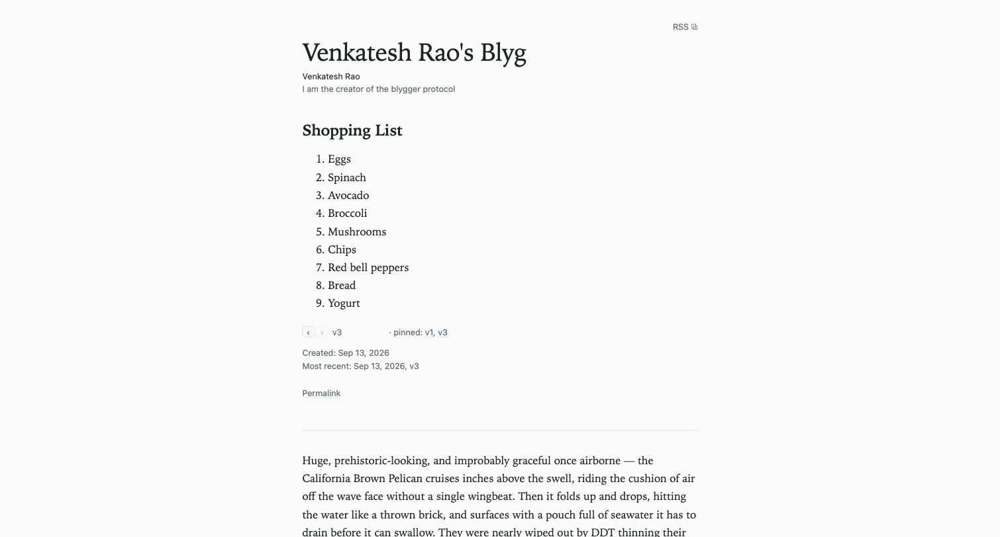
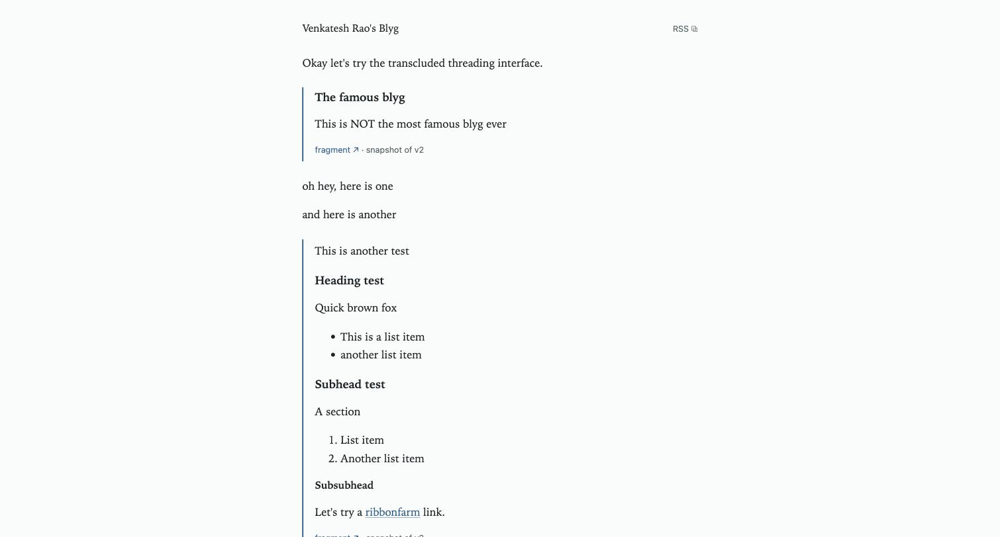
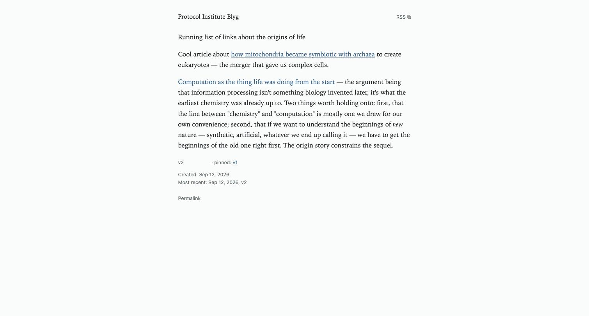

<!--
  One file, one talk. Edit this; everything else is derived.

  Format:
    # Heading        starts a SECTION (applies to slides that follow)
    ## Heading       starts a SLIDE
         the slide's image — ordinary markdown, alt text included
    - a list         what's PROJECTED. Nest with two spaces for sub-bullets.
    **Cues**         speaker prompts below the fold. Not projected.
    **Notes**        "why this slide exists", collapsed on the page.

  Slides are numbered by position, so inserting or reordering one renumbers the
  rest automatically — no ids to keep in sync. The cost is that #slide-NN
  permalinks move when you insert above them, which is the right trade while the
  deck is still in draft.

  A slide with no bullets is treated as a placeholder and marked as such.
-->

# Opening

## What is Blygger

- A decentralized, p2p, AI-native social publishing protocol
- A **minimal** update to the blogging and old-Twitter experiences — not a new one
- Degrades gracefully: legacy RSS readers see an ordinary feed and lose nothing
- Some inspiration from Robin Sloan's Spring '83
- Fixes the **synchronic/diachronic temporality tension** in traditional media
  — loosely, "Twitter time" vs. "GitHub time"
- Supports fine-grained generative AI use at the **block** level

**Cues**

- Read the list fast; the two that matter are the last two, and they're the rest
  of the talk.
- "Minimal" is doing work: this is not a new medium, it's a small change to two
  existing ones.
- Spring '83 — name-check, don't explain unless asked.

**Notes**

Deliberately a dense opening list rather than a slow build: this audience wants the
shape of the thing in thirty seconds, and the two load-bearing claims (temporality,
block-level generation) each get their own section later.

## Etymology

- **Blyg** — Swedish for "shy", and nearly homophonic with "blog"
- **Blygger** — a hat-tip to Blogger
- **ygg** — a gesture at Yggdrasil, the Norse cosmic tree of life

**Cues**

- Quick slide. Don't over-explain the joke.
- If it lands, the shy/blog homophony is the one worth pausing on.

**Notes**

Three readings stacked in one word, which is the right amount of etymology for a
protocol talk: enough that the name is memorable, not so much that it becomes the
subject.

## Two kinds of time

- **Diachronic** — time as a *sequence of states*. The thing changes, and the record
  of it changing is the point.
  - a git log: every commit carries a message about what changed
  - a blog series; a book's editions; a changelog
- **Synchronic** — time as a *present moment*. The thing is a snapshot, and the
  moment is the point.
  - a Twitter feed: hot takes, all now, never revised
  - a group chat; a livestream

**Cues**

- Define both properly — this is the conceptual spine and the room needs the words.
- GitHub time vs. Twitter time as the handles; the Greek is the precision.
- Neither is better. They're different things media are for.

**Notes**

The whole design argument rests on these two words, so they get a slide of their own
rather than a passing definition. Sub-bullets are examples, not argument — say them
fast.

## Handling both at once is hard

- **Threads are clumsy** — a synchronic medium doing an impression of a diachronic one
- **Editable tweets break provenance** — if it can change silently, what did you
  actually say?
- **Nobody reads changelogs** — a diachronic record with no synchronic surface
- Each fix for one property damages the other

**Cues**

- These are three failed attempts at the same problem, not three separate gripes.
- The provenance point is the one this audience will already have opinions about.
- Land: nobody has made one medium do both well.

**Notes**

Three concrete, familiar failures rather than an abstract statement of the tension —
everyone in the room has been annoyed by all three, which does the persuading for you.

## Books solve this by being very, very slow

- An **edition** is a diachronic event a synchronic reader can actually see
- It works *because* editions are rare — years apart, a handful per book
- You cannot run a conversation at that tempo
- So: keep the edition, drop the latency

**Cues**

- The one existing solution that works, and why it doesn't generalise.
- Last bullet is the hinge into the rest of the talk — pins are editions at
  conversation speed.

**Notes**

Closes the opening by naming the one medium that genuinely solves the tension, then
naming its cost. Sets up pins (slide 15) as the answer without spending the word yet.

# How it feels to use

## A blyg is fragments and threads

- Two units, not one: a **fragment** (a note) and a **thread** (fragments composed)
- Every item wears its own revision history in public — `v3 · pinned: v1, v3`
- A real page, live at venkateshrao.com/blyg/

**Cues**

- Live page, mine, right now.
- Most media give you one unit and you pretend everything is that shape.
- Point at the version line. Every item wears its revision history in public.
  Needs no explanation — it's on the page.
- That line is the diachronic surface, sitting inside a synchronic feed.

**Notes**

Opens on the artifact rather than the architecture, and the version line is the thing
to point at: it is the previous section's abstract tension made concrete in one line of
page furniture.

## Transclusion: quote by reference

- Write `![[id]]` on its own line — you get the fragment, not a link to it
- Snapshotted at publish: the reader gets the bytes you saw, forever
- Provenance under every quote: which item, which version
- Editing the source later never rewrites the quote

**Cues**

- The blue-ruled block is not copy-paste. I wrote `![[id]]` on its own line.
- **Snapshotted at publish.** Reader gets the bytes I saw. Editing the source later
  never rewrites this quote.
- Embeds break or drift. This can't do either.
- If there's a line worth landing: quoting is the load-bearing act in written culture
  and most media made it worse.

**Notes**

"Never rewrites the quote" is the line that lands with this audience — it's the
difference between transclusion-as-embed (which breaks) and transclusion-as-snapshot
(which doesn't). Real example: venkateshrao.com/blyg/t/1vgtgz0g25ztpdsn9hq23x5pxk/

## [TK]: leave an instruction in the draft

- `[TK]expand this into a paragraph[/TK]` — an instruction, not yet run
- `[TK]expand this[=]…generated prose…[/TK]` — after you run it
- Inside a TK scope, `![[id]]` means **source**, not quote — material to work from
- Generation is always an explicit act you review. Publishing never generates.
- The markers are studio-private. They never reach the wire.

**Cues**

- TK = copy-desk mark, "to come". A century old. Text known to be missing.
- Form 1: instruction not yet run. Form 2: same scope after running — instruction and
  output both still in the draft, side by side.
- **The subtle bit, say it slowly:** inside a TK scope, `![[id]]` means *source*, not
  quote. Same syntax, two meanings, decided by whether it's inside a scope.
- This is the "block-level generative AI" claim from slide 1, cashed out.

**Notes**

The two-form grammar is the whole mechanism. The quote-vs-source rule is the subtlest
part of the design and the part most likely to be misunderstood, so it gets said slowly
and then demonstrated on the next two slides.

## Which paragraph was generated?

- A real published page. One of these I wrote. One a model wrote.

**Cues**

- Real published page from the other node. Two paragraphs. One mine, one a model's.
- **Ask the room. Let it sit.** Take a guess or two. Do not answer on this slide.

**Notes**

Deliberately one bullet and no answer. This slide is a question put to the room, and a
slide that answers its own question while asking it is not asking it — the audience
reads bullets faster than the speaker can set the beat up. Let it sit, take a guess or
two, then advance.

## You can't tell. That is deliberate.

- The item JSON says: `generated[{sources, model, at}]` — two scopes, claude-opus-5
- The HTML carries a `blyg-tk-gen` class you can inspect. It is deliberately unstyled.
- Disclosure is total. It just isn't decorative.
- A visible tint would present a self-asserted claim as a verified badge

**Cues**

- Answer: you can't tell. Nothing on the page marks it.
- Show what the page *does* carry: JSON provenance; the class, visible in view-source
  in three seconds.
- **Why no tint:** provenance is self-asserted, nothing verifies it, a colour would
  start meaning "verified". A badge that looks authoritative and isn't is worse than
  no badge.
- Second reason if there's room: I read it and kept it. At that point it's mine.

**Notes**

The strongest argument in the deck. Provenance here is self-asserted and unverifiable;
the protocol refuses to represent what it cannot back, and this is that principle at
its least comfortable.

## Writing it

- The same thread you just saw published — the other side of it
- **The preview tints the generated blocks. The published page doesn't.**
- The protocol governs only the page. Everything else here is my client's choice.

**Cues**

- Same thread as the last two slides, seen from the author's side.
- Walk the shape before the detail: source left, preview right, scope panel below.
  Nobody can read the text from the room and they don't need to.
- Point at the scope panel: instructions survive generating. Nothing is thrown away,
  and regenerate is one click.
- Left pane, if anyone asks: `[TK] Summarize this ![[id]] [=] …output… [/TK]`.
- **The tinting is the punchline.** The studio highlights what was generated because
  I'm the author and I need to see it. The published page doesn't, because a reader
  can't verify the claim. Same bytes, two surfaces, different obligations.
- Everything on this screen is my client's choice and no part of the standard. A
  completely different studio isn't non-compliant — it's just a different studio.

**Notes**

The strongest argument for the studio/page split, because it's visible rather than
asserted: put this slide next to slide 09 and the same paragraph is tinted in one and
plain in the other. That contrast was not planned — it fell out of decision #25 and the
studio's own preview highlighting, and it does the explaining better than the prose
did. The original bullets here described the interface instead, which was the weaker
slide.

# How it works

## It's just files

- A blyg is a directory: `blyg.json`, `feed.xml`, `items/*.json`, a page per item
- No database in the protocol. Copy the directory to any web host and it still works.
- Root, subdirectory, or subdomain — the protocol never assumes where you put it
- We check this by exporting the whole blyg to flat files and diffing

**Cues**

- A blyg is a directory. Manifest, feed, one JSON per item, a page per item. That's it.
- No database in the protocol. Mine uses one because it's a live authoring tool.
- Mounts anywhere. Protocol never assumes.
- Don't ask them to take it on faith: we export and diff against what the live server
  serves.

**Notes**

Motivation first: the reason "just files" matters to an author is that it's the only
durable answer to "what happens when the company shuts down". The last bullet is the
honest part — a claim we check mechanically rather than assert.

## It's still RSS

- Every blyg feed is a valid RSS feed. Your existing reader works today.
- A reader that's never heard of blygger sees a normal feed and loses nothing
- A blyg can subscribe to any RSS or Atom feed — no cooperation required
- So your blog is already half in: it can be read, it just can't be quoted

**Cues**

- Valid RSS. Not RSS-like.
- Works the other direction too: subscribe to anything on the open web.
- Anecdote if useful: subscribed mine to Simon Willison; he publishes Atom, which is
  how Atom support got written.
- **Frame for publishers:** you're already half in. What upgrading buys is being
  *quotable*.

**Notes**

This is the slide that makes the medium joinable rather than a walled garden with
better manners. The graceful-degradation claim from slide 1, cashed out.

## You don't get a username

- No accounts, no handles, no `@you@server`. There is no namespace to be in.
- Your domain is your name. DNS is the namespace — it already exists and works.
- Author names are decoration: optional, per-item, the protocol promises nothing
- The only thing the protocol authenticates is the origin the bytes came from
- So: no follower lists, no counts, no follow requests. Following is client-local
  and invisible.

**Cues**

- **The argument:** every namespace is a registry, every registry has an owner, and the
  owner is the thing we were trying not to have.
- Follow it through: there is no number to go up.
- Expect pushback here. This is the slide they'll argue with.

**Notes**

The section's load-bearing slide and the one most likely to be argued with. Identity,
like AI, is deliberately never in the protocol.

## Nothing is deleted. Some things are promised forever.

- No hard delete. The single exit is **withdraw** — a permanent, visible endcap.
- A **pin** is an irrevocable promise to host one exact version, forever
- Pins survive withdrawal. That is the point of a pin.
- Unpinned history is unreachable in every representation — no route serves it
- Version numbers are a bare counter. Significance is the pin, not the number.

**Cues**

- Withdraw: URL answers forever, says "withdrawn".
- Pins survive withdrawal. Withdraw the piece, the cited version still resolves.
- Unpinned versions served by no route, or withdrawal would be theatre.
- **The line:** an edition bump is cheap talk; a pin is a costly signal.
- **Call back to slide 5:** this is the book's edition, at conversation speed.

**Notes**

Where the opening's temporality argument pays off: a pin is a diachronic event with a
permanent synchronic surface, which is what books get from being slow and this gets
from being expensive.

# For implementers

## The wire, for protocol people

- Two planes: `items/{id}.json` is state (ground truth, full archive); `feed.xml` is
  notification (lossy, just a signal)
- AP under partition. Convergence is poll-driven and eventual — ~25 min observed,
  ~45 worst case.
- The archive index is the reconciliation surface; the feed is a cheap trigger.
  Gaps degrade to an index diff, never to loss.
- Version watermarks never silently regress — a lower version is surfaced as a
  suspected history rewrite, not applied
- IDs are stable random 128-bit. Never content-addressed — identity must survive editing.
- Conformance L0–L3, strict supersets. Unknown constructs ignored, not rejected.

**Cues**

- Gear change — jargon is fine here.
- **The inversion worth explaining:** reconciliation surface is the index, not the feed.
  So a dropped entry / clock skew / malformed feed degrades to a slower sync, not data
  loss — which is what lets the notification plane be as lossy as RSS actually is.
- Watermarks: loud, not prevented.

**Notes**

Choosing the archive index rather than the feed as the reconciliation surface is what
lets the notification plane be lossy without the state plane being lossy — which is
what makes plain RSS a sufficient notification layer, and therefore what makes slide
13's compatibility claim structurally possible rather than a courtesy.

## What is deliberately not enshrined

- **AI.** Generation is studio-side; the wire gets output plus provenance.
- **Identity.** Opaque, client-asserted, never addressable.
- **Editorial convenience.** No reply primitive, ever — transclusion is the primitive.
- **Significance markup.** No semver, no edition field. Pins carry weight instead.
- Four separate decisions, months apart, same sentence each time.

**Cues**

- I didn't notice the pattern until the fourth one.
- **Principle:** anything the protocol can't verify, it declines to represent — because
  a field that looks authoritative and isn't corrupts the fields that are.

**Notes**

The closest the deck gets to a thesis, and it belongs with the technical audience, who
will recognise the discipline.

# Roadmap

## Where it is, where it's going

- Shipped: publish (v0.1), subscribe + blogroll + curation (v0.2), instructed
  generation (TK-core)
- Running: two live nodes, real cross-node pub-sub, a legacy-RSS subscription
- Next: v0.3 — threads across clients, Webmention with structural verification
- Then: filter plugins, staleness over the DAG, local RAG, then 1.0 freeze
- Pre-1.0 means no promises — including the wire. Nothing is stable until 1.0.

**Cues**

- Webmention: reused not invented, with structural verification (receiver checks the
  source actually names the target).
- **Say the last bullet plainly before asking for involvement:** building the client is
  how the protocol gets tested; twice last month that changed the spec.

**Notes**

The last bullet is decision #21, not a disclaimer. Inviting participation without it
would be a misrepresentation, and this audience will respect the stance.

# How to participate

## If you write

- Nothing to install yet, honestly — the self-host template is v1.0 RC work
- What's useful now: tell me where the fragment/thread split feels wrong
- Especially: does writing with `[TK]` change *what* you write, or just how fast?
- Read the two live blygs; both are real writing, not fixtures

**Cues**

- Be straight that there's no product yet.
- The TK question is the one where author experience actually decides a design question
  that's still open.

**Notes**

A specific ask beats a general one, and there is no point pretending there is something
to install.

## If you publish

- You already have the hard part: a domain nobody can take from you
- Your RSS feed already makes you readable from a blyg — no action needed
- A blyg mounts anywhere: yoursite.com/blyg/, blyg.yoursite.com, or the root
- Ask of you: if you'd never run this, say why — that's the most useful failure report

**Cues**

- Mount independence matters here specifically: adopting this isn't rebuilding a site
  that already works.
- **The ask is the opposite of adoption.** A clear account of why this isn't for you is
  worth more right now than another install.

**Notes**

Publisher-facing framing, and the inverted ask is genuine rather than rhetorical — at
this stage, negative signal is scarcer and more useful than positive.

## If you build

- Spec: blygger.org/spec/0.2/ — standalone, complete, no deltas to chase
- Reference client: MIT, Cloudflare Workers, ~420 tests
- Documented CSS contract — which classes are wire-visible and what you owe them
- The open gap: a **second reference implementation**. Local-first, folder-based,
  static-host deploy.
- That second implementation is the 1.0 gate. It is undesigned. It could be yours.

**Cues**

- One implementation isn't a protocol, it's a program with a spec next to it.
- Undesigned. Unstarted. Highest-leverage thing in the room.

**Notes**

The highest-leverage ask in the deck, so it goes last and it is specific: a second
implementation on a different substrate is what turns a spec into a protocol, and it is
a named gate rather than a nice-to-have.

# Resources

## Resources

- Live: venkateshrao.com/blyg/ · blyg.protocol-institute.org
- Spec: blygger.org/spec/0.2/ · Notes: blygger.org/notes/ · Namespace: blygger.org/ns/0.1
- Code: github.com/blygger — MIT (code), CC-BY-4.0 (docs)
- blygger.com — commercial-adjacent, not yet built
- This deck, with cues, is at the URL on screen

**Cues**

- All on screen, and this deck is a web page — links are there afterwards.
- blygger.com: domain exists, nothing else yet — say so rather than omitting it.
- Thanks.

**Notes**

Every link is live and verified except blygger.com, which is named as not-yet-built
rather than quietly omitted.
